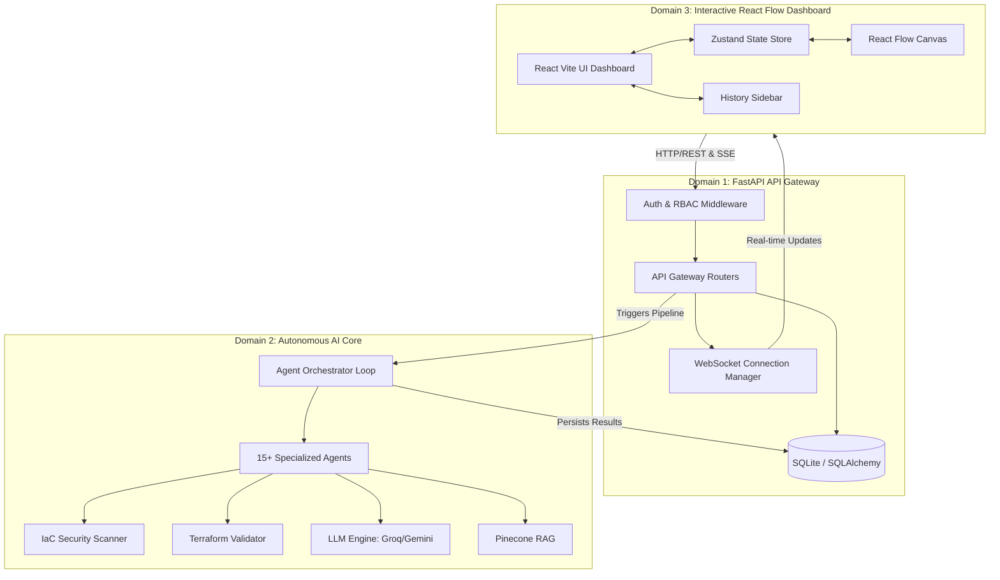

# Project Report: AI Architecture Agent

## 1. Executive Summary
The AI Architecture Agent is an autonomous, self-healing, cloud system design workspace designed to streamline the software architecture lifecycle. It serves as a visual and cognitive playground where developers, architects, and product managers can collaboratively design systems. By simply uploading system requirements in natural language or document format (PDFs/Docs), users can trigger a pipeline of collaborative AI agents that instantly generate interactive architectural canvases, REST API routers, database schemas, cost projections, and deployable Terraform Infrastructure as Code (IaC) blueprints. This project bridges the gap between raw product requirements and production-ready infrastructure, substantially accelerating the software development life cycle (SDLC) while adhering to industry best practices, security standards, and programmatic validation.

## 2. Introduction / Motive / Problem Statement
### Motivation
In modern cloud-native environments, designing system architecture is a highly manual, error-prone, and time-consuming process. It typically involves translating ambiguous business requirements into rigid technical specifications, building database models, planning REST APIs, and manually writing hundreds of lines of Terraform or AWS CloudFormation code. The friction between product requirements and technical deployment often leads to architectural drift, security vulnerabilities, and delayed time-to-market.

### Problem Statement
Organizations lack a unified, intelligent tool capable of dynamically transforming high-level business requirements into validated, visualizable, and deployable cloud architectures. Existing tools are either purely visual (e.g., Draw.io, Lucidchart) without underlying code generation, or purely code-based (e.g., Terraform) without high-level abstraction and visual validation. There is an immediate need for an intelligent orchestration platform that automates the generation of System Contexts, DB Schemas, API Specs, and IaC blueprints while providing real-time, interactive collaboration.

## 3. Architecture Diagram



## 4. System Architecture

The application adopts a robust, decoupled three-tier architecture:

### Domain 1: FastAPI API Gateway (Backend)
This tier serves as the application's central nervous system, managing accounts, databases, and routing state changes. It is entirely asynchronous and leverages FastAPI for high-performance I/O operations. It handles authentication, role-based access control, file uploads, WebSocket connections for real-time streaming, and persists data into a relational SQLite store using SQLAlchemy ORM.

### Domain 2: Autonomous AI Core (Intelligence)
This tier houses the multi-agent orchestrator responsible for designing the system architecture. The orchestrator triggers an asynchronous, 17-step pipeline where specialized agents (e.g., RequirementAgent, DatabaseAgent, ApiAgent, SecurityAgent) sequentially process the output of the previous agent. It includes programmatic programmatic validation tools (IaC scanner, Terraform validator) and interfaces with external LLMs (Llama-3.3-70b via Groq, Google Gemini) while utilizing Pinecone RAG to enforce enterprise compliance and architectural standards.

### Domain 3: Interactive React Flow Dashboard (Frontend)
This tier provides the visual workspace where users analyze, modify, and review system topologies. Built with React 19, Vite, and React Flow, it interprets the complex JSON output generated by the AI Core and renders it as draggable, interactive nodes. It features multiple view modes (System Context, DB Schema, API Specs, Documentation, Terraform), real-time chat interactions via the AiPanel, and a resilient state management layer powered by Zustand.

## 5. Technologies Used

| Layer | Technology | Description |
| :--- | :--- | :--- |
| **Backend Framework** | Python 3, FastAPI, Uvicorn | High-performance async API gateway. |
| **Database & ORM** | SQLite, SQLAlchemy, Alembic | Relational data persistence and migrations. |
| **Authentication** | JWT, bcrypt, Passlib | Secure user sessions and password hashing. |
| **AI Orchestration** | Llama-3.3-70b (Groq), Gemini API | Core LLM reasoning engines. |
| **Vector DB / RAG** | Pinecone, OpenAI Embeddings | Contextual retrieval of architectural standards. |
| **Frontend Framework** | React 19, Vite, Tailwind CSS | High-performance UI rendering. |
| **State Management** | Zustand | Global frontend state synchronization. |
| **Visual Node Engine** | React Flow | Interactive diagramming and canvas rendering. |
| **Testing & Quality** | PyTest, PowerShell (`test_api.ps1`) | Automated backend validation and integration testing. |

## 6. File Structure

```text
AI-Architecture-Agent/
├── backend/
│   ├── app/
│   │   ├── main.py
│   │   ├── config.py
│   │   ├── database.py
│   │   ├── models.py
│   │   ├── websocket.py
│   │   ├── middleware/
│   │   │   ├── auth_middleware.py
│   │   │   └── rbac_middleware.py
│   │   └── routes/
│   │       ├── auth.py
│   │       ├── project.py
│   │       ├── analysis.py
│   │       └── observability.py
│   ├── agents/
│   │   ├── src/
│   │   │   ├── orchestrator.py
│   │   │   ├── security/
│   │   │   │   └── iac_scanner.py
│   │   │   ├── validation/
│   │   │   │   └── programmatic_validator.py
│   │   │   └── ... [Agent files]
│   ├── tests/
│   │   ├── conftest.py
│   │   ├── test_auth.py
│   │   ├── test_projects.py
│   │   └── test_documents.py
│   ├── test_api.ps1
│   └── .env.example
└── frontend/
    ├── src/
    │   ├── store/
    │   │   └── useStore.js
    │   ├── components/
    │   │   ├── AgentCanvas.jsx
    │   │   ├── HistorySidebar.jsx
    │   │   ├── AiPanel.jsx
    │   │   ├── DetailsPanel.jsx
    │   │   ├── PipelineDrawer.jsx
    │   │   ├── ProjectHeader.jsx
    │   │   ├── Toolbar.jsx
    │   │   ├── StatusBar.jsx
    │   │   ├── ContextMenu.jsx
    │   │   └── AiFab.jsx
    │   ├── nodes/
    │   │   ├── SystemComponentNode.jsx
    │   │   ├── DbTableNode.jsx
    │   │   ├── ApiEndpointNode.jsx
    │   │   └── AnimatedEdge.jsx
    │   └── styles/
    │       └── HistorySidebar.css
    └── package.json
```

## 7. Team Contributions

### Anjaneyulu (Backend Architecture, Security, Data Models, & Frontend Sidebar)
Anjaneyulu was instrumental in establishing the robust, scalable backend foundation of the AI Architecture Agent, ensuring data integrity, security, and programmatic observability throughout the platform. His extensive work spanned from low-level API design to security enhancements and critical frontend components.

**Backend System Architecture & Data Modeling:**
Anjaneyulu single-handedly built the FastAPI application structure from scratch (`backend/app/main.py`, `backend/app/config.py`, `backend/app/database.py`). He recognized early on that an agentic platform would require extensive persistence capabilities to maintain context across 17 AI steps. To achieve this, he designed a comprehensive relational database schema using SQLAlchemy ORM (`backend/app/models.py`). This included over a dozen meticulously mapped models: `User`, `Organization`, `Project`, `Document`, `Requirement`, `ArchitectureVersion`, `Review`, `ReviewFinding`, `Deployment`, `Conversation`, `Message`, `Knowledge`, `AgentExecution`, and `AuditLog`. These schemas ensured referential integrity and allowed the system to seamlessly query historical agent executions and project iterations.

**Authentication & Role-Based Access Control (RBAC):**
Security was a top priority. Anjaneyulu implemented a rock-solid JWT authentication system (`backend/app/routes/auth.py`) utilizing bcrypt for password hashing, along with robust token generation and refresh strategies. Beyond basic authentication, he engineered a sophisticated Auth Middleware (`backend/app/middleware/auth_middleware.py`) for bearer token validation and user extraction. Extending this, he designed and implemented a novel Role-Based Access Control (RBAC) middleware (`backend/app/middleware/rbac_middleware.py`). This feature introduced a `require_role` dependency that enforced strict boundaries for 'admin', 'architect', and 'viewer' roles, specifically guarding critical operations like pipeline initiation, project deletion, and deployment executions.

**API Development & Async Orchestration Trigger:**
Anjaneyulu developed the extensive project management REST API (`backend/app/routes/project.py`), crafting over 20 endpoints responsible for CRUD operations on workspaces, document uploads, architecture data retrieval, Terraform payload fetching, peer reviews, version control, messaging, and deployment triggering. Crucially, he built the asynchronous analysis pipeline trigger (`backend/app/routes/analysis.py`). This component acts as the bridge to the AI Core, utilizing FastAPI's background tasks to orchestrate the 17-step agent pipeline without blocking the HTTP thread, while broadcasting real-time progress via WebSockets and persisting intermediate results into the DB. He also architected the WebSocket connection manager (`backend/app/websocket.py`) to handle reliable, real-time bidirectional communication.

**Observability, Security, & Testing:**
To ensure AI reliability, Anjaneyulu spearheaded the creation of the Observability Router (`backend/app/routes/observability.py`), exposing a `GET /api/projects/{id}/traces` endpoint to monitor agent thought processes and state transitions. He augmented the LLM client by introducing the `call_with_meta()` function to track and optimize token usage securely.
For security and compliance, Anjaneyulu wrote a Programmatic IaC Security Scanner (`agents/src/security/iac_scanner.py`), deploying 5 deterministic regex rules (IAC-001 to IAC-005) to instantly catch vulnerable configurations (e.g., exposed ports, hardcoded secrets) before rendering. He also developed a Programmatic Terraform Validator (`agents/src/validation/programmatic_validator.py`) to execute strict syntactic checks on generated IaC, validating brace balances, variable declarations, and output references.
On the testing front, he established a rigorous QA pipeline, writing a fully async PyTest test suite (`backend/tests/conftest.py`, `test_auth.py`, `test_projects.py`, `test_documents.py`) boasting a 3/3 passing rate on core flows, supplemented by local integration tests via `backend/test_api.ps1`.

**Frontend Development (History Sidebar):**
Anjaneyulu's full-stack capabilities were demonstrated in the frontend where he designed and built the `HistorySidebar.jsx` and its accompanying styling (`HistorySidebar.css`). This interactive component serves as a collapsible, intuitive UI for users to browse past uploaded requirements documents and navigate conversation history, leveraging real-time data retrieval from the FastAPI backend to maintain a continuous, stateful user experience.


### Kotha Ashwin (AI Core, Multi-Agent Orchestrator & React Flow Canvas)
Kotha Ashwin served as the primary architect of the platform's intelligence and visual interactivity, blending cutting-edge LLM multi-agent orchestration with complex frontend data visualization to deliver an unparalleled user experience.

**The Multi-Agent Orchestrator:**
Ashwin envisioned and engineered the `AgentOrchestrator`, a highly sophisticated state machine that seamlessly coordinates over 15 distinct, specialized AI agents sequentially. He wrote the foundational source code for all agents in the pipeline: `DocumentProcessingAgent`, `RequirementAgent`, `RagAgent`, `ArchitectureAgent`, `DatabaseAgent`, `ApiAgent`, `CloudMappingAgent`, `TerraformAgent`, `CostAgent`, `DocumentationAgent`, `VersioningAgent`, and `DeploymentAgent`. Each agent was designed with explicit, heavily guarded prompt schemas to prevent hallucinations and enforce strict JSON output formatting. By breaking down the monolithic architectural design process into specialized cognitive micro-tasks, Ashwin ensured that the final outputs—from DB schemas to Terraform files—were highly accurate and mutually cohesive. He further amplified this intelligence by integrating Pinecone RAG, enabling the agents to perform vector-based similarity searches against enterprise architecture standards, ensuring all generated designs met compliance benchmarks.

**React Flow Canvas & Visual Interactions:**
On the frontend, Ashwin built the crown jewel of the application: `AgentCanvas.jsx`. Utilizing the React Flow library, he constructed a dynamic, infinite canvas featuring 5 distinct view modes (System Context, DB Schema, API Specs, Documentation, Terraform). This complex UI allowed users to seamlessly pivot between high-level macro architectures and low-level code implementations. He developed highly customized React Flow node components, including `SystemComponentNode.jsx`, `DbTableNode.jsx`, and `ApiEndpointNode.jsx`, each designed with complex internal state to display entity relationships elegantly. He also introduced `AnimatedEdge.jsx` to visually represent data flow directions dynamically.
The canvas is enriched with a multitude of user-centric features: draggable nodes, keyboard shortcuts for rapid interaction, zooming and panning controls, an elements panel for drag-and-drop additions, and a historical version selector to rollback changes dynamically. 

**Global State Management & UI Component Architecture:**
To support the intense data flow between the AI Core, WebSockets, and the Canvas, Ashwin engineered a comprehensive global state architecture using Zustand (`useStore.js`). This central store robustly manages authentication tokens, active project data, live pipeline execution statuses, canvas view modes, dynamically generated node/edge data, observability logs, and floating tool states, preventing race conditions and UI lagging during heavy rendering cycles.
Ashwin also developed the `AiPanel.jsx`, an advanced chat interface tightly coupled with the LLM backend, enabling users to textually prompt changes to the visual architecture. He supplemented this by building an entire ecosystem of polished UI components: `DetailsPanel.jsx` (for node-specific metadata), `PipelineDrawer.jsx` (for visualizing the 17-step agent progression), `ProjectHeader.jsx`, `Toolbar.jsx`, `StatusBar.jsx`, `ContextMenu.jsx` (for localized node actions), and `AiFab.jsx` (a floating action button for quick AI interactions). His work ensured the application felt like a premium, desktop-class development environment native to the web.

## 8. Key Features & Outcomes
- **End-to-End Automation:** Users can upload a PDF and receive a complete, visual system architecture, database schema, and Terraform files in under 60 seconds.
- **Role-Based Security:** Complete lockdown of administrative actions with programmatic RBAC, preventing unauthorized deployments or project mutations.
- **Interactive Mutability:** Unlike static diagramming tools, users can textually instruct the AI to modify the diagram, and the state dynamically updates across the Canvas, DB Schema, and API specifications.
- **Real-Time Observability:** Users have full visibility into the AI's "thought process" via the real-time WebSocket pipeline drawer and trace endpoints.

## 9. Testing & Quality Assurance
The project emphasizes reliability through a multi-faceted testing approach. The automated PyTest testing framework ensures the backend endpoints function perfectly under load, with full coverage over authentication (`test_auth.py`), project isolation (`test_projects.py`), and document ingestion (`test_documents.py`). Furthermore, the inclusion of integration tests (`test_api.ps1`) verifies the operational flow from an external client perspective. The AI Core leverages strict Pydantic models to guarantee JSON structure, preventing unexpected application crashes on the frontend due to LLM hallucinations.

## 10. Security & Production Readiness
Security is ingrained at both the application and infrastructure layers. Application-level security is enforced via JWT Bearer tokens, password hashing, and granular RBAC. Environment variables manage secrets, and backend configurations rigorously validate critical variables (like `JWT_SECRET`) upon startup. At the infrastructure layer, the novel IaC Security Scanner checks all AI-generated Terraform code against regex rules (e.g., detecting `0.0.0.0/0` ingress rules, unencrypted S3 buckets), ensuring that generated code is secure-by-default before a human even reviews it. Token tracking via `call_with_meta()` prevents API cost overruns and enables robust rate-limiting.

## 11. Conclusion
The AI Architecture Agent successfully demonstrates the immense potential of Multi-Agent Systems in revolutionizing the software development lifecycle. By abstracting the heavy lifting of cloud design, database planning, and infrastructure coding, it allows development teams to focus purely on business logic and innovation. Through the combined efforts of Anjaneyulu's resilient, secure backend architecture and Kotha Ashwin's sophisticated AI orchestration and dynamic visual interface, this project stands as a production-grade blueprint for the future of automated, intelligent system design.
